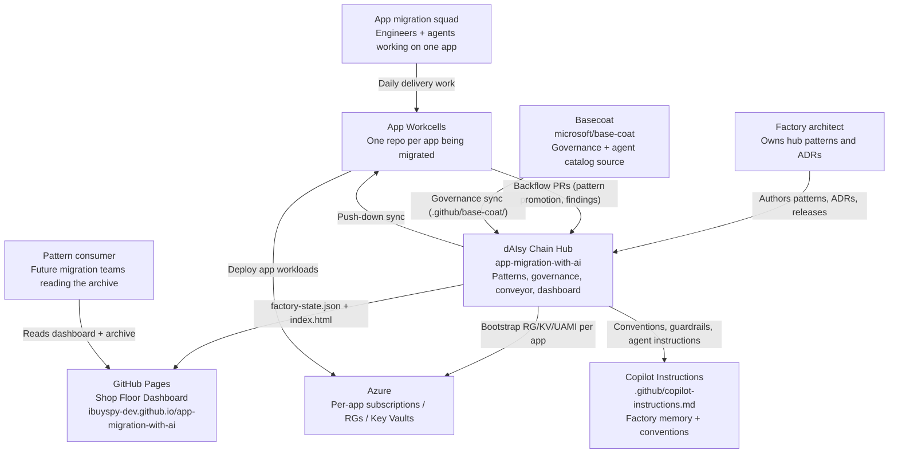
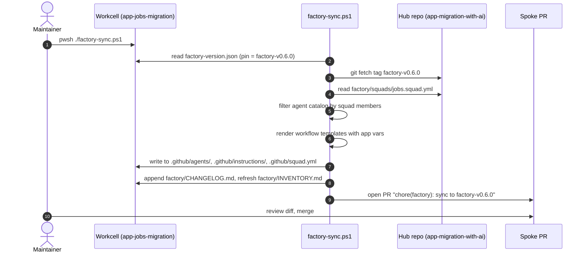
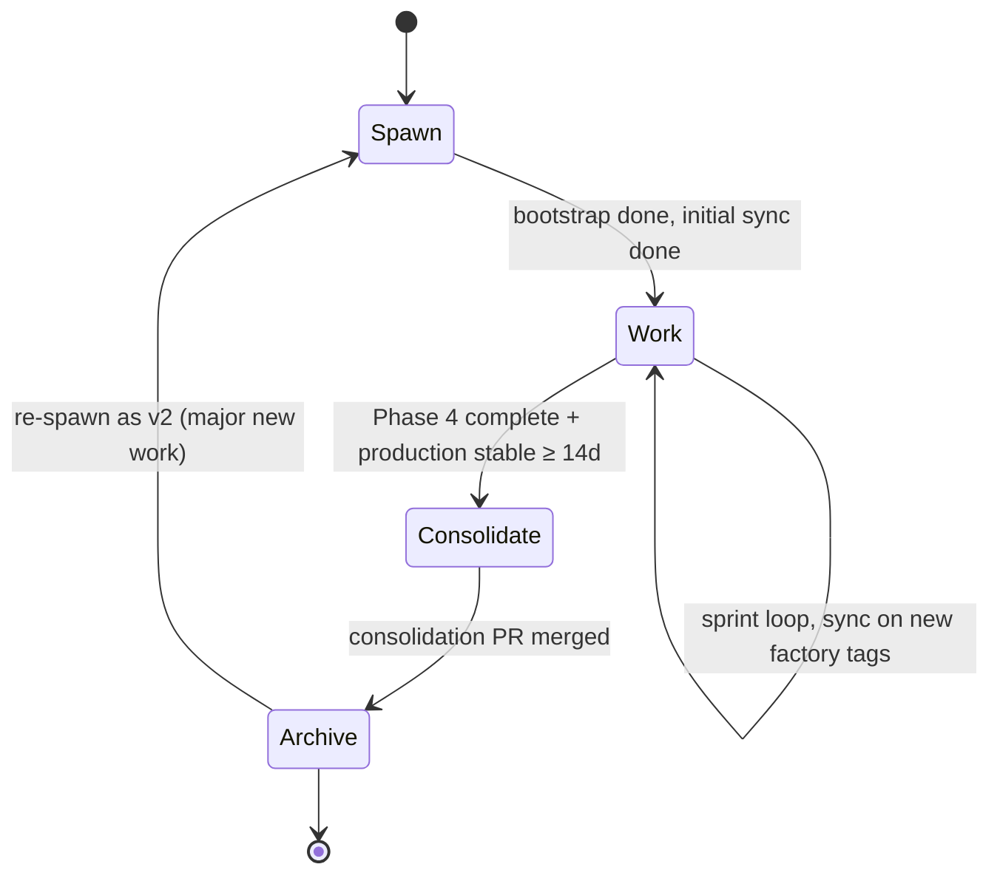

# Migration Factory Architecture

> **Status:** Accepted — see ADR-004, ADR-005, ADR-006, ADR-007, ADR-008
> **Owner:** `architect` agent (in `app-migration-with-ai`)
> **Last updated:** 2026-05-04

This document describes the architecture of the AI-native migration factory: an opinionated system for modernizing a fleet of legacy ASP.NET applications using dedicated agent squads, shared patterns pushed down from a hub, and a consolidate-then-archive lifecycle.

## 1. Goals

- Modernize multiple legacy applications in parallel without context bleed between them
- Maintain one source of truth for shared patterns (agents, instructions, IaC, workflows)
- Let each application's squad work in isolation while patterns evolve fleet-wide
- Preserve every artifact from every migration in a single, browseable archive
- Survive churn: new apps spawn cleanly, finished apps consolidate cleanly, broken apps re-spawn cleanly

## 2. Non-goals

- A general-purpose monorepo manager
- A registry of reusable runtime libraries (the artifacts here are *patterns*, not packages)
- A replacement for org-level governance, security, or identity tooling
- A rewrite of Basecoat — this factory **uses** Basecoat as its governance anchor

## 3. System Context (C4 Level 1)



## 4. Container Diagram (C4 Level 2)

```mermaid
flowchart TD
    architect["👤 Factory architect"]
    squad["👤 App squad"]

    subgraph hub["Hub: app-migration-with-ai"]
        agents[".github/agents/\nMarkdown — Agent catalog"]
        instr[".github/instructions/\nMarkdown — Governance + standards"]
        bcoat[".github/base-coat/\nPS + JSON — Basecoat sync infra"]
        boot["factory/bootstrap/\nBicep + PS — Per-app Azure bootstrap"]
        squads["factory/squads/\nYAML — Per-app squad manifests"]
        tmpl["factory/templates/workflows/\nYAML — Workflow templates"]
        modules["factory/iac-modules/\nBicep — Shared IaC modules"]
        syncps["factory/sync-all.ps1\nPowerShell — Hub-side push sync"]
        consol["factory/consolidate.ps1\nPowerShell — Pull spoke artifacts on Phase 5"]
        adrs["docs/adrs/\nMarkdown — Architecture decisions"]
        archive["apps/name/\nMixed — Consolidated final artifacts"]
    end

    subgraph spoke["Spoke: app-jobs-migration (one of N)"]
        srcS["src/\nASP.NET / .NET 8 — App source"]
        infraS["infra/\nBicep — App-specific infra"]
        wfS[".github/workflows/\nYAML — App deploy workflow (rendered)"]
        squadS[".github/squad.yml\nYAML — Synced squad"]
        agentsS[".github/agents/ (subset)\nMarkdown — Synced squad's agents"]
        instrS[".github/instructions/\nMarkdown — Synced governance"]
        syncS["factory-sync.ps1\nPowerShell — Spoke-side pull sync"]
        verS["factory-version.json\nJSON — Pinned factory tag"]
        invS["factory/INVENTORY.md + CHANGELOG.md\nMarkdown — Sync metadata"]
    end

    azure["☁️ Azure"]

    architect -->|"Edits"| agents
    architect -->|"Edits"| instr
    architect -->|"Edits"| modules
    architect -->|"Edits"| tmpl
    architect -->|"Edits + reviews"| adrs

    squad -->|"Implements"| srcS
    squad -->|"Edits"| infraS

    syncps -->|"Pushes (filtered by squad)"| agentsS
    syncps -->|"Pushes"| instrS
    syncps -->|"Renders + pushes"| wfS
    syncps -->|"Pushes from factory/squads/app.squad.yml"| squadS
    syncS -->|"Pulls pinned tag"| hub
    syncS -->|"Reads pin"| verS
    syncS -->|"Updates"| invS

    boot -->|"Provisions per-app RG/KV/UAMI"| azure
    wfS -->|"Deploys app via UAMI federated cred"| azure

    consol -->|"Writes apps/name/"| archive
    consol -->|"Reads final state"| srcS
    consol -->|"Reads final state"| infraS
```



## 5. Repository Roles

| Role | Repo | Owns |
|---|---|---|
| **Hub** | `IBuySpy-Dev/app-migration-with-ai` | Agent catalog, instructions, Basecoat anchor, factory bootstrap, IaC modules, workflow templates, squad manifests, ADRs, cross-cutting issues, consolidated archive (`apps/`) |
| **Spoke** | `IBuySpy-Dev/app-<name>-migration` | App source, app infrastructure, app workflows, app-specific issues, synced patterns (read-only from spoke's POV) |
| **Governance source** | `IBuySpy-Shared/basecoat` | Universal governance (synced into hub's `.github/base-coat/`) |

## 6. Push-down Sync (ADR-005)

### Sync direction

- **Hub → spoke (push):** `factory/sync-all.ps1 -Tag factory-v0.6.0 [-App jobs|all]` opens a PR against each spoke. Used for fleet-wide rollouts and hotfixes.
- **Spoke → hub (pull):** `factory-sync.ps1` (lives in the spoke) reads `factory-version.json` and pulls the pinned tag. Used by spoke maintainers to opt into a new factory version.

Both write the synced files into well-known locations in the spoke; both append a row to `factory/CHANGELOG.md` and refresh `factory/INVENTORY.md`. App-owned files (`src/`, `infra/foundation.bicep`, `infra/main-legacy.bicep`, `.github/workflows/deploy.yml`) are never overwritten.

### Sync sequence (spoke-side pull)



### What is synced

| Artifact | Direction | Sync? | Notes |
|---|---|---|---|
| `.github/agents/` | hub → spoke | Filtered by squad | Spoke gets only its squad's agents |
| `.github/instructions/` | hub → spoke | All | Governance applies everywhere |
| `.github/base-coat/` | hub → spoke | Pass-through | Hub IS Basecoat to spokes |
| `factory/templates/workflows/*.yml` | hub → spoke | Rendered | Vars: `APP_NAME`, `KEY_VAULT_NAME`, `BOOTSTRAP_RESOURCE_GROUP`, `PWGEN_IDENTITY_NAME` |
| `factory/iac-modules/` | hub → spoke | Copied | `infra/modules/` in the spoke |
| `factory/squads/<app>.squad.yml` | hub → spoke | Renamed | Lands as `.github/squad.yml` |
| `docs/adrs/` | hub-only | Linked from spoke READMEs | Single source of truth |
| Spoke findings | spoke → hub | Pulled at Phase 5 | Lands in `apps/<name>/findings/` |

## 7. Agent Squad Model (ADR-006)

Each app gets a curated squad. Squad manifests live in the hub and sync down as `.github/squad.yml`.

### Default squad

```yaml
# factory/squads/_default.squad.yml
squad:
  name: migration-squad
  inherits_from: hub
  members:
    - app-inventory
    - migration-advisor
    - backend-dev
    - data-tier
    - devops-engineer
    - security-analyst
    - code-review
  cross_cutting:
    - architect
    - prompt-engineer
    - tech-writer
```

### Per-app overrides

| App | LOC | Risk | Squad additions |
|---|---|---|---|
| Jobs | 4 K | LOW | (default) |
| TimeTracker | 3.2 K | MED | + performance-analyst |
| IBusSpy | 5.4 K | HIGH | + security-analyst (already in default), + sre-engineer |
| Classifieds | 6.5 K | MED-HIGH | + frontend-dev |
| PetShop | 8.2 K | HIGH | + frontend-dev, + performance-analyst, + sre-engineer |

Cross-cutting agents (architect, prompt-engineer, tech-writer) stay in the hub. Spokes invoke them by reference; they are not duplicated locally.

## 8. Bootstrap Orchestration

Per-app per-environment Azure resources are created by `factory/bootstrap/bootstrap.ps1` from the hub. Bootstrap creates:

- `rg-<app>-<env>-bootstrap` — bootstrap resource group
- `kv-<app>-<env>-bs` — Key Vault (RBAC, soft-delete, 7-day retention)
- `umi-pwgen-<app>-<env>` — managed identity that generates the VM admin password

RBAC granted by bootstrap:

- Workflow service principal → Key Vault → `Key Vault Secrets User` (read secrets at deploy time)
- Bootstrap UAMI → Key Vault → `Key Vault Secrets Officer` (write generated password)

Bootstrap then sets repo variables on the spoke (`gh variable set`):

- `BOOTSTRAP_RESOURCE_GROUP`
- `KEY_VAULT_NAME`
- `PWGEN_IDENTITY_NAME`

App workflows consume these as Bicep parameters; the password itself is generated in-cluster by a Bicep `deploymentScript` (under the bootstrap UAMI) and never leaves Azure.

## 9. Lifecycle (ADR-007)



### Phase 5 consolidation (the gate)

`factory/consolidate.ps1 -App <name>` runs from the hub:

1. Reads the spoke's final state (`src/`, `infra/`, monitoring, runbooks, retrospectives)
2. Writes them into `apps/<name>/`:

```
apps/<name>/
├── og-source/          # Original ASP.NET (immutable snapshot from spoke @ initial commit)
├── migrated/           # Phase 1-2 final state: rehost + replatform + IaC + monitoring
├── modernized/         # Phase 3 final state: .NET 8 + IaC + arch docs + monitoring
├── findings/
│   ├── inventory.md
│   ├── treatment-decisions.md
│   ├── migration-log.md
│   ├── incidents/
│   ├── perf-comparison.md
│   ├── cost-comparison.md
│   └── retrospective.md
└── README.md           # Index + link to archived spoke
```

3. Opens a consolidation PR in the hub
4. On merge: tags spoke `consolidated-vYYYYMMDD`, runs `gh repo archive` on the spoke
5. Closes hub epic

The DoD gate is in `docs/architecture/migration-phases.md`.

## 10. Issue Routing

| Where the issue lives | What it covers |
|---|---|
| Hub | Cross-cutting patterns, ADRs, factory hotfixes, Basecoat sync, fleet-wide refactors, consolidation epics, hub-only agent/instruction work |
| Spoke | App-specific bugs, app deployments, app infrastructure, app code, app retrospectives |

Cross-references: hub epics include explicit `Tracks: <spoke>#N` lines. Spoke issues that surface a fleet-wide pattern open a `[hub-promotion]` issue in the hub linking back.

## 11. Inter-repo Dispatch

Cross-repo automation uses GitHub `repository_dispatch`:

- Hub publishes a new factory tag → triggers `factory-sync` workflow in each spoke pinned to a compatible MINOR
- Spoke completes Phase 4 → can dispatch a `phase-5-ready` event to the hub to open the consolidation epic

Dispatch is preferred over polling for latency and audit clarity.

## 12. Versioning (ADR-008)

- Hub releases as Git tags: `factory-vMAJOR.MINOR.PATCH`
- Spokes pin in `factory-version.json`
- N-2 lag policy (current and two prior minor versions supported for hotfixes)
- Hotfixes: PATCH cut on every supported MINOR; pushed as PRs by the hub

## 13. Knowledge Backflow

The hub gets smarter every cycle:

- Spoke patterns judged broadly applicable open `[hub-promotion]` issues → reviewed → merged into `factory/iac-modules/` or `.github/instructions/`
- Phase 5 retrospectives feed the next inventory's risk model
- Common incidents become entries in the error knowledge base (`error-kb/patterns/`)

## 14. Operational Notes

- All Azure auth is OIDC federated (no client secrets). See `docs/guardrails/oidc-federation.md`.
- All Azure resources follow CAF naming. See `docs/guardrails/caf-naming.md`.
- All passwords generated in Azure (Bicep `deploymentScript`) and kept in Key Vault. Consumed by VM modules via `kv.getSecret()`.
- All workflow secrets via `${{ secrets.* }}` and OIDC. No literals. See `docs/guardrails/secrets-in-workflows.md`.

## 15. Related ADRs

- ADR-001 — SQL Server strategy
- ADR-001 — Strangler fig pattern
- ADR-002 — App Service over AKS
- ADR-003 — Per-app isolation
- ADR-004 — Migration factory topology
- ADR-005 — Push-down sync model
- ADR-006 — Agent squad model
- ADR-007 — Spawn-consolidate-archive lifecycle
- ADR-008 — Factory versioning and pinning policy
